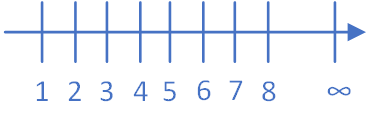
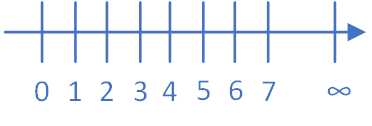
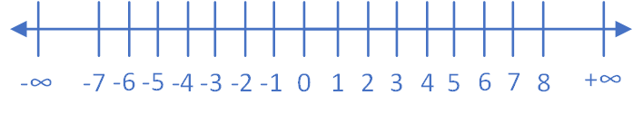

# Numbers {#numbers}

This chapter will introduce you to numbers and their significance in mathematics and computing.
Since the beginning of humanity numbers were used to be able to count. The first evidence found that humans were counting was discovered in 1970 by _Peter Beaumont_ near the Lebombo Mountains. The artifact was a baboon fibula that had 29 straight cuts (see figure 1.1). It is hypothesised that it was used to count the menstrual cycles of women. Thus, it can be said that the first astronomers / mathematicians were women.  

```{r, out.width='100%', fig.align='center', fig.cap='The Lebombo bone 44, 000 BC (top) and the Ishango bone 20, 000 BC (bottom)', echo=FALSE}
knitr::include_graphics('images/Lebombo-bone.png')
```

Numbers were and still are used to advance our civilization, from computing to art and music. From simple counting we have used numbers to calculate and measure. To achieve thought all of these advancements different types of numbers have been used, each having its own usage. 

## Types of Number

### Number Zero
Zero as a mathematical symbol has a turbulence timeline. Although its first appearance was first seen by the Sumerians in Mesopotamia, some 5,000 years ago, it was used very infrequently by the Greeks and nothing has been found about the notion of zero by the Romans. On the other hand it has been seen by the Myans, Hindus, Chinese, but the way we use it today and its notions first appeared in the 20th century.

### Natural Numbers (N)
One of the oldest and familiar number type are the natural numbers $N$.
Natural numbers are used for counting and in arithmetic calculations. These include all whole numbers from 1 to infinity $\infty$

```{r, out.width='40%', fig.align='center', fig.cap='Natural Numbers', echo=FALSE}

```

### Whole Numbers (W)
The most common numbers used are for counting and are used in arithmetic calculations. These are whole numbers from 1 to infinity and zero.

```{r, out.width='40%', fig.align='center', fig.cap='Whole Numbers', echo=FALSE}

```

### Integer Numbers (Z)
Another important set of numbers, especially for computing, are all whole numbers including negative whole numbers.These numbers are called Integer numbers and the range covered are all integer numbers from negative infinity to zero and from zero to positive infinity.

```{r, out.width='60%', fig.align='center', fig.cap='Integer Numbers', echo=FALSE}

```

In computer programming these are the most used number set, as they are used in *loops* as well as determining locations in memory. These are the numbers that are more efficient to be processed by a CPU and thus in many situation developers would prefer to use integer maths for effciency.

A significant property of integers is that when two integers are added, subtracted, or multiplied, the result is always another integer. However, when an integer is divided by another integer, the result can either be an integer or a fraction. This is very important especially in computing as a division of integers would change the type of variable you are using.

### Rational Numbers (Q)
All numbers that can be expressed as a fraction (ratio) of integers are called rational numbers, as long as the denominator is not zero. So, rational numbers include all integer numbers as all integer number can be divided by 1 and become a fraction. 


### Irrantional Numbers (R\Q)

In computer science, it is significant if a number is rational or irrational. A rational number can be stored as an exact numeric value, while an irrational number must be estimated.

When dealing with rational numbers in computing these could be easily stored as two integers, but when dealing with irrational numbers usually an estimation is necessary.
An example of that is the irrational number of the mathematical constant $\pi$. This constant is the ratio of the circumference of any circle to the diameter of that circle, regardless of the circle's size. The number of digits for $\pi$ are infinite $\infty$ and it would be impossible to store a number with unlimited digits, so it often estimate to be $3.14$.

### Real Numbers (R)
If we include all rational and irrational numbers we get another in a set we get another set called real numbers.
This number set is the most common and used by everyone, as it include all numbers. 

### Complex Numbers (C)
When dealing with measuring or counting, real numbers are sufficient to describe what we want. When though we are trying to describe more than one dimension we find that real numbers are not enough and complicate measurements and calculations when trying to define or understand some of the notions of a point in space. The solution is to use multi-dimensional numbers, and through this it was found that besides real numbers there are also imaginary numbers. Imaginary numbers are nothing else that the multiplication of a real number to the "unit" of the imaginary number. The "unit" is the square root of -1 $\sqrt-1$.
Complex numbers are all numbers that have a single real number and a single imaginary number.

## Algebraic Properties
In this module we are going to be dealing mostly with real numbers, besides some exceptions. Thus, it would be good to know some of the basic algebraic properties of real numbers.

### Closure
When adding or multiplying two real numbers the result is always a real number.
$a + b$ and $ab$ are always real numbers if $a$ and $b$ are real numbers.

### Commutative
While adding or multiplying real numbers the position of the numbers do not alter the result.

$a + b + c = b + a + c = a + c + b$

similarly,

$abc = cba$

```
_Addition_
24 + 42 + 23 + 55 = 144   

can also be written as

42 + 23 + 55 + 24 = 144   

or

55 + 42 + 24 + 23 = 144   

_Multiplication_
10 * 24 * 2 = 480

can also be written as

2 * 24 * 10 = 480

or

24 * 2 * 10 = 480

```

### Associative
When adding or multiplying real numbers, grouping does not have an effect on the result. By grouping we mean placing a parentheses $($ between numbers.

$(a+b) + c = a + (b+c) = a + b + c$

similarly,

$(ab)c = a(bc) = abc$

### Distributive
A multiplication can be right distributive if the multiplication appears from the right
$(a+b)c = ac+bc$

or left distributive if it appears from the left

$c(a+b) = ca + cb$

### Identity
Any real number that a zero is added it always is equal to the number.
$a+0 = 0+a = a$

### Inverse
The inverse property of addition states that any number that is added to its opposite will be equal to zero
$a + (-a) = 0$

The inverse property of multiplication states that any number that is multiplied by its reciprocal will be equal to one.
$a(1/a) = 1$

### Cancelation
Cancellation of a number can be done when dealing with real numbers that are not zero
$a+x=a+y, then x=y$

similarly for multiplication
$ax=ay, then x=y$

### Zero-factor
Any real number that is multiplied to a zero it always is equal to zero.
$a0 = 0a = 0$

### Negation
If a positive real number is multiplied by another negative number the result is always negative. 
$-(-a) = a, (-a)b= a(-b) = -(ab)$

If a negative real number is multiplied by another negative number the result is always positive.
$(-a)(-b) = ab$


## BIDMAS or BODMAS
When trying to evaluate an expression we need to know which arithmetic operations we should apply first.
For example
$3+5*2=...$
Would it be equal to 16(if we do the addition first) or 13(if we do the multiplication first)?

There rule that we need to apply is called the BODMAS or BIDMAS rule. These are acronyms for stand for:
*B*rackets
*O*rders or *I*ndices
*D*ivision
*M*ultiplication
*A*ddition
*S*subtraction

Using the above rule there are four priorities. First priority are the Brackets, second indices or powers, third are division and multiplication and fourth are addition and subtraction.

## LCM and HCF

## Fractions

## Decimals

## Percentages

## Rounding Numbers

## Standard Form
