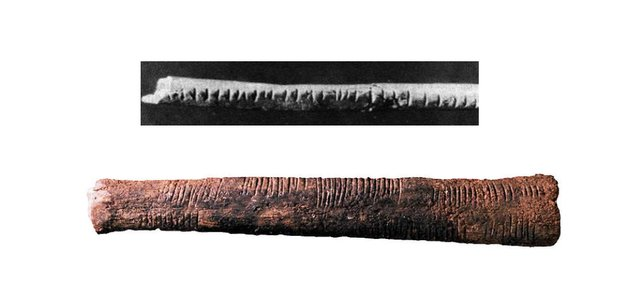

# Numbers {#numbers}

This chapter will introduce you to numbers and their significance in mathematics and computing.
Since the beginning of humanity numbers were used to be able to count. The first evidence found that humans were counting was discovered in 1970 by _Peter Beaumont_ near the Lebombo Mountains. The artifact was a baboon fibula that had 29 straight cuts (see figure 1.1). It is hypothesised that it was used to count the menstrual cycles of women. Thus, it can be said that the first astronomers / mathematicians were women.  

```{r, out.width='100%', fig.align='center', fig.cap='The Lebombo bone 44, 000 BC (top) and the Ishango bone 20, 000 BC (bottom)', echo=FALSE}

```

Numbers were and still are used to advance our civilization, from computing to art and music. From simple counting we have used numbers to calculate and measure. To achieve thought all of these advancements different types of numbers have been used, each having its own usage. 

## Types of Number

### Number Zero
Zero as a mathematical symbol has a turbulence timeline. Although its first appearance was first seen by the Sumerians in Mesopotamia, some 5,000 years ago, it was used very infrequently by the Greeks and nothing has been found about the notion of zero by the Romans. On the other hand it has been seen by the Myans, Hindus, Chinese, but the way we use it today and its notions first appeared in the 20th century.

### Natural Numbers (N)
One of the oldest and familiar number type are the natural numbers $N$.
Natural numbers are used for counting and in arithmetic calculations. These include all whole numbers from 1 to infinity $\infty$

### Whole Numbers (W)
The most common numbers used are for counting and are used in arithmetic calculations. These are whole numbers from 1 to infinity

### Integer Numbers (Z)
### Rational Numbers (Q)
### Irrantional Numbers (R\Q)
### Real Numbers (R)
### Complex Numbers (C)
## Algebraic Properties
In this module we are going to be dealing mostly with real numbers, besides some exceptions. Thus, it would be good to know some of the basic algebraic properties of real numbers.

### Closure
a + b and ab are real numbers

### Commutative
> We can change the position of the number for multiplication and addition without altering the result.

a + b = b + a, ab = ba

```
_Addition_
24 + 42 + 23 + 55 = 144   

can also be written as

42 + 23 + 55 + 24 = 144   

or

55 + 42 + 24 + 23 = 144   

_Multiplication_
10 x 24 x 2 = 480

can also be written as

2 x 24 x 10 = 480

or

24 x 2 x 10 = 480

```

### Associative
(a+b) + c = a + (b+c), (ab)c = a(bc)

### Distributive
(a+b)c = ac+bc

### Identity
a+0 = 0+a = a

### Inverse
a + (-a) = 0, a(1/a) = 1

### Cancelation
If a+x=a+y, then x=y

### Zero-factor
a0 = 0a = 0

### Negation
-(-a) = a, (-a)b= a(-b) = -(ab), (-a)(-b) = ab


## BIDMAS

## LCM and HCF

## Fractions

## Decimals

## Percentages

## Rounding Numbers

## Standard Form
